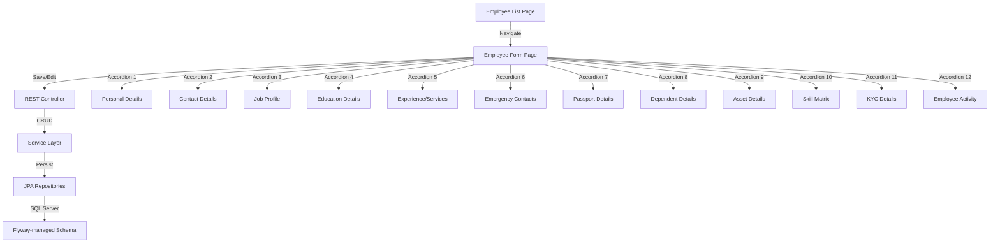

# Employee Master Module — Implementation Plan

## Architecture Overview

## Phase 1: Backend — Flyway Migration + Models

### V2.0 Flyway Migration
Creates 12 new child tables with FK to `HRM_EMPLOYEE_MASTER`:

| Table | Relationship | Purpose |
|-------|-------------|---------|
| `HRM_EMP_PERSONAL_DETAIL` | 1:1 | Personal info, IDs, sizes |
| `HRM_EMP_CONTACT` | 1:1 | Permanent + communication address |
| `HRM_EMP_JOB_PROFILE` | 1:1 | Banking, allowances, PF/ESI |
| `HRM_EMP_EDUCATION` | 1:N | Education history table |
| `HRM_EMP_EXPERIENCE` | 1:N | Work experience table |
| `HRM_EMP_EMERGENCY_CONTACT` | 1:N | Emergency contacts table |
| `HRM_EMP_PASSPORT` | 1:1 | Passport details |
| `HRM_EMP_DEPENDENT` | 1:N | Family dependents table |
| `HRM_EMP_ASSET` | 1:N | Company assets table |
| `HRM_EMP_SKILL_MATRIX` | 1:1 | Skill proficiency |
| `HRM_EMP_KYC` | 1:1 | KYC master fields |
| `HRM_EMP_KYC_DOCUMENT` | 1:N | KYC document attachments |
| `HRM_EMP_ACTIVITY` | 1:N | Activity log |

### Main Entity Expansion (HRM_EMPLOYEE_MASTER)
New columns added via Hibernate ddl-auto=update:
- `sub_category_id`, `grade_code`, `old_emp_code`
- `first_name`, `last_name`, `guest`
- `daily_sheet_required`, `petrol_allowance`, `team_group`
- `user_name`, `shift_duration`, `next_revision_date`
- `additional_role`, `induction_status`, `attendance_required`
- `production_line`, `emp_class`, `exit_date`, `exit_reason`
- `shift`, `shift_name`, `grace_minutes`
- `nda_certificate_upload`, `fitness_certificate_upload`
- `home_manager`, `business_manager`, `supplier_name`

## Phase 2: Backend — Repositories + Service + Controller

### API Endpoints
| Method | Path | Purpose |
|--------|------|---------|
| GET | `/api/master/employee` | List all employees |
| GET | `/api/master/employee/{id}` | Get employee with all sub-resources |
| POST | `/api/master/employee` | Create employee |
| PUT | `/api/master/employee/{id}` | Update employee |
| DELETE | `/api/master/employee/{id}` | Delete employee + cascade |
| **Sub-resources** | | |
| GET/POST/PUT/DELETE | `/api/master/employee/{id}/personal` | Personal details |
| GET/POST/PUT/DELETE | `/api/master/employee/{id}/contact` | Contact details |
| GET/POST/PUT/DELETE | `/api/master/employee/{id}/job-profile` | Job profile |
| GET/POST/PUT/DELETE | `/api/master/employee/{id}/education` | Education list |
| GET/POST/PUT/DELETE | `/api/master/employee/{id}/experience` | Experience list |
| GET/POST/PUT/DELETE | `/api/master/employee/{id}/emergency-contact` | Emergency contacts |
| GET/POST/PUT/DELETE | `/api/master/employee/{id}/passport` | Passport details |
| GET/POST/PUT/DELETE | `/api/master/employee/{id}/dependent` | Dependents list |
| GET/POST/PUT/DELETE | `/api/master/employee/{id}/asset` | Assets list |
| GET/POST/PUT/DELETE | `/api/master/employee/{id}/skill-matrix` | Skill matrix |
| GET/POST/PUT/DELETE | `/api/master/employee/{id}/kyc` | KYC details |
| GET/POST/PUT/DELETE | `/api/master/employee/{id}/kyc-document` | KYC documents |
| GET/POST/PUT/DELETE | `/api/master/employee/{id}/activity` | Activity log |

## Phase 3: Frontend — List Page (BOS Compliant)

Follows `DepartmentDetails.jsx` pattern exactly:
- `MainCard` + `BOSDataTable`
- Global filters: Unit Name, Left Company, Category, Department, Designation, Status
- Export Excel button
- `+ New` button → navigates to form page
- Double-click row → navigates to form page in edit mode
- `ConfirmDeleteDialog` for delete
- `useKeyboardShortcuts` for Ctrl+N, Escape

## Phase 4: Frontend — Form Page (Full Page with Accordions)

Uses `MainCard` with expandable `Accordion` sections:
- Main section: always visible, all basic employee fields in a grid
- 11 expandable accordion sections matching the spec
- Sub-tables use `BOSDataTable` within accordions
- Action buttons: Back, Delete, Save, Clear
- `useKeyboardShortcuts` for Ctrl+S, Escape
- `useBOSValidation` for form validation
- `openSnackbar` for feedback (never `alert()`)

## Phase 5: Wiring

- Route: `/hra/hr/employee/master` → List, `/hra/hr/employee/master/create` → Form
- Menu: Already wired under HRA → HR → Employee → Employee Master
- API Constants: Add sub-resource paths to `api-constants.js`

## File Manifest

### Backend (14 new files, 3 modified)
| Action | File |
|--------|------|
| CREATE | `db/migration/V2.0__Employee_Master_Expansion.sql` |
| CREATE | `model/EmployeePersonalDetail.java` |
| CREATE | `model/EmployeeContact.java` |
| CREATE | `model/EmployeeJobProfile.java` |
| CREATE | `model/EmployeeEducation.java` |
| CREATE | `model/EmployeeExperience.java` |
| CREATE | `model/EmployeeEmergencyContact.java` |
| CREATE | `model/EmployeePassport.java` |
| CREATE | `model/EmployeeDependent.java` |
| CREATE | `model/EmployeeAsset.java` |
| CREATE | `model/EmployeeKyc.java` |
| CREATE | `model/EmployeeKycDocument.java` |
| CREATE | `model/EmployeeActivity.java` |
| CREATE | 12 repository interfaces |
| MODIFY | `model/EmployeeMaster.java` |
| MODIFY | `service/EmployeeMasterService.java` |
| MODIFY | `controller/EmployeeMasterController.java` |

### Frontend (2 rewritten, 1 modified)
| Action | File |
|--------|------|
| REWRITE | `views/master/hr/EmployeeList.jsx` |
| REWRITE | `views/master/hr/EmployeeMaster.jsx` |
| MODIFY | `utils/api-constants.js` |
